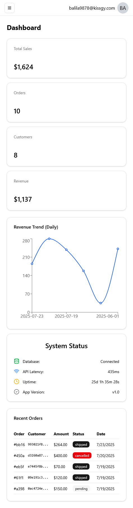
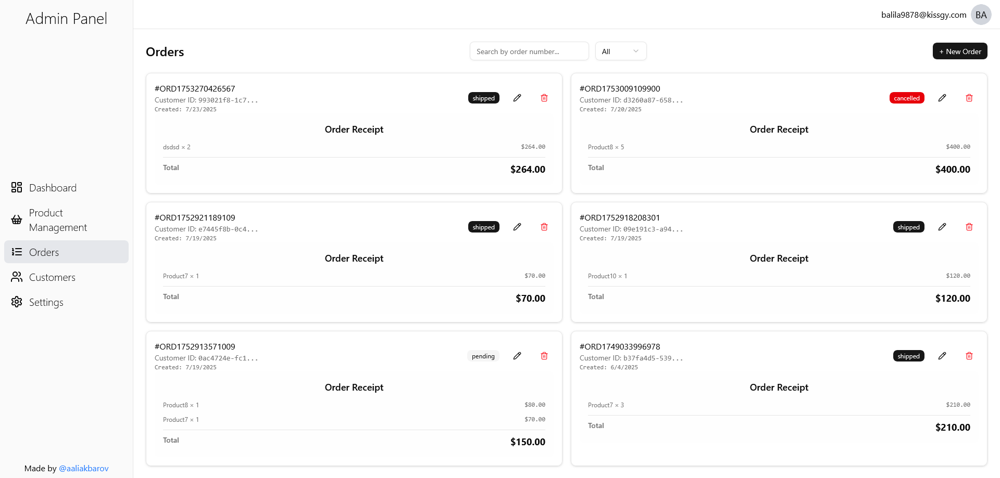

# Simple React E-Commerce Admin Panel

A React-based admin panel for managing the products, users, and orders from the virtual market. Includes CRUD operations, dashboard, overview with some stats about overall products, basic settings, simple design, showcases the use of React concepts, and integration with Supabase as a backend.

## Features

-   Manage products, users, and orders
-   CRUD operations for all entities
-   Dashboard with overview and statistics
-   Basic settings management
-   Simple, clean design
-   Demonstrates React concepts and component structure
-   Fully responsive design using Tailwind CSS
-   Integrates with Supabase as backend

## Demo

<table>
  <tr>
    <td>
      
    </td>
    <td>
      
    </td>
  </tr>
</table>

## Tech Stack

-   React.js (functional components, hooks)
-   Supabase (backend as a service)
-   Tailwind CSS (styling)
-   React Router v6+ (familiar with actions, used for navigation)
-   React Hook Form (form handling)
-   React Query (data fetching)

## Note

This project is provided for **code review purposes only**.
The backend (Supabase) may not be running constantly, so it is **not intended to be run locally**.
The focus is on reviewing the React code, structure, and implementation of concepts.
If requested, I can demonstrate the working application during an interview.
