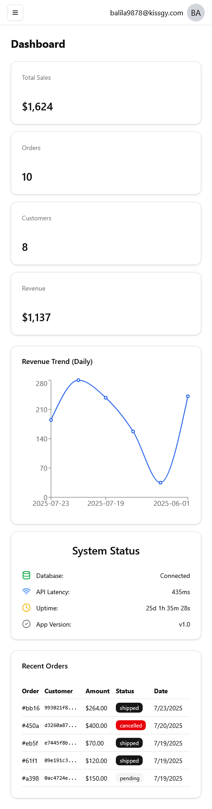
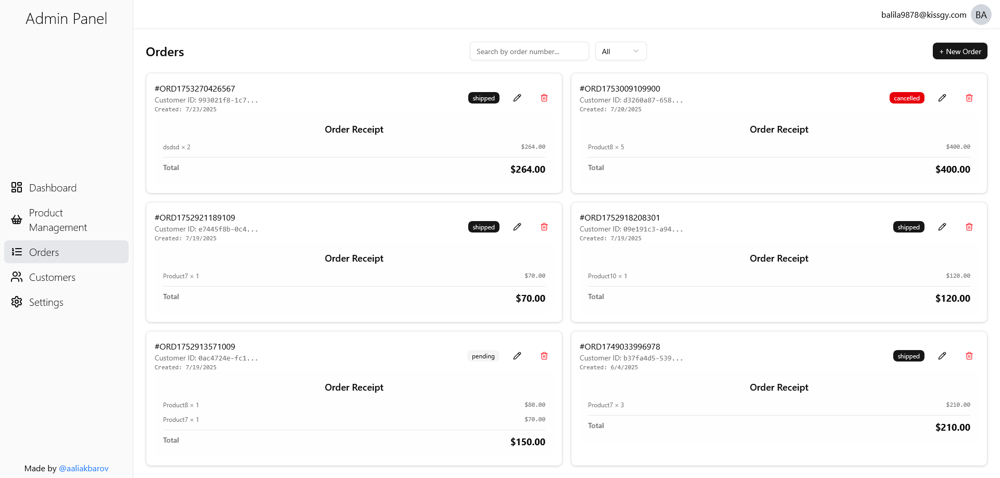

# Simple React + TypeScript E-Commerce Admin Panel

A React + TypeScript-based admin panel for managing products, users, and orders in a virtual market.  
Includes CRUD operations, dashboard analytics, and settings management, built with a focus on clean architecture and integration with Supabase as a backend.

---n

## Features

- Manage products, users, and orders
- Full CRUD operations for all entities
- Dashboard with overview and statistics
- Basic settings management (email/password)
- Authentication with Supabase
- Protected routes system
- Responsive UI with Tailwind CSS
- Clean component-based architecture
- Demonstrates React + TypeScript patterns (hooks, context, forms, state management)

---

## Demo

<table>
  <tr>
    <td>
      
    </td>
    <td>
      
    </td>
  </tr>
</table>

---

## Tech Stack

- React + TypeScript
- Supabase (backend as a service + auth)
- Tailwind CSS (styling)
- React Router v6+ (nested routes, protected routes)
- React Hook Form (form handling with typed schemas)
- TanStack React Query (server state management)

---

## Note

This project is provided for **code review / portfolio purposes only**.

The backend (Supabase) may not always be running, so it is **not guaranteed to be fully functional locally at all times**.

The focus is on:

- React architecture
- State management patterns
- TypeScript usage
- Component structure and reusability

If needed, a live demonstration can be provided during review or interview.
